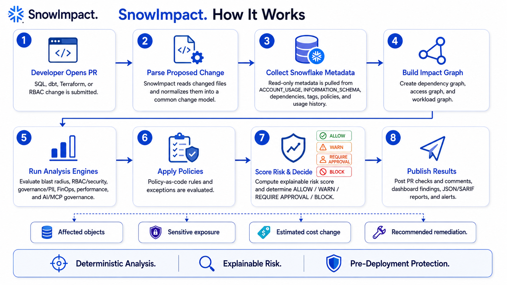
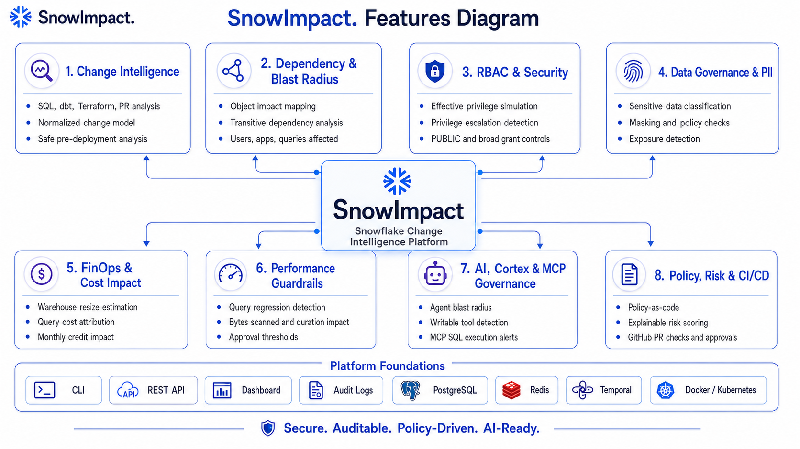
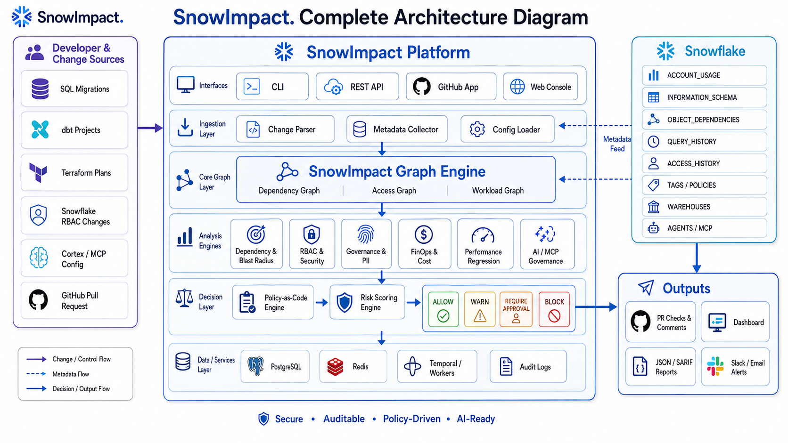

# SnowImpact

**Snowflake change intelligence and policy firewall.**

SnowImpact analyzes proposed Snowflake changes before production and answers:

> What will this change break, expose, slow down, or cost?

It parses SQL, Terraform and dbt metadata, correlates changes with live Snowflake metadata, builds a dependency/access graph, runs deterministic security/governance/FinOps/performance rules, evaluates policy-as-code, calculates an explainable risk score, and returns `ALLOW`, `WARN`, `REQUIRE_APPROVAL`, `BLOCK`, or `UNKNOWN`.

<p align="center">
  
</p>

## Highlights

<p align="center">
  
</p>

- Snowflake SQL change parsing with the Snowflake dialect
- Downstream dependency and blast-radius analysis
- Effective RBAC / privilege expansion analysis
- PII and sensitive-data exposure checks
- Masking/governance propagation checks
- Warehouse resize and monthly credit impact estimates
- Static performance guardrails
- Cortex/MCP/agent governance model
- YAML policy-as-code and time-bound exceptions
- Explainable weighted risk scoring plus hard critical overrides
- CLI, REST API, GitHub Action, SARIF output, and web dashboard
- dbt manifest and Terraform plan adapters
- Demo mode requiring no Snowflake account
- Docker Compose, Kubernetes Helm chart, Alembic migrations
- Structured logging, Prometheus metrics, audit records, API-key auth, GitHub webhook HMAC verification
- Read-only Snowflake design. Proposed PR SQL is parsed, never executed

## Architecture

<p align="center">
  
</p>

```text
SQL / dbt / Terraform / PR
            |
            v
      Change Parser
            |
            v
   Normalized Change IR
            |
            +------------------+
            |                  |
            v                  v
   Snowflake Metadata      Declared metadata
            |                  |
            +---------+--------+
                      v
                Impact Graph
                      |
       +--------------+--------------+
       |       |       |       |      |
       v       v       v       v      v
    Lineage Security Governance FinOps Performance
       \       |       |       |      /
        +------+-------+-------+-----+
                      |
                 AI Governance
                      |
                      v
                 Policy Engine
                      |
                      v
                  Risk Engine
                      |
          ALLOW / WARN / APPROVAL / BLOCK
```

## Repository layout

```text
snowimpact/
├── snowimpact/
│   ├── api/              FastAPI service
│   ├── collectors/       Snowflake and demo metadata collectors
│   ├── core/             configuration, schemas, logging
│   ├── db/               SQLAlchemy persistence
│   ├── engines/          parser, graph, security, governance, FinOps, risk
│   ├── integrations/     dbt, Terraform, GitHub App
│   └── workflows/        Temporal workflow example
├── web/                   Next.js operations console
├── policies/default/      policy-as-code defaults
├── scripts/               Snowflake least-privilege setup
├── deployments/helm/      Kubernetes chart
├── migrations/            Alembic migrations
├── github-action/         composite GitHub Action
├── examples/demo/         safe and dangerous sample changes
└── tests/                 unit and integration tests
```

## Quick start. Demo mode

Python 3.12+ is required.

```bash
python -m venv .venv
source .venv/bin/activate
pip install -e '.[dev]'
cp .env.example .env
snowimpact doctor
snowimpact demo
```

Analyze a migration:

```bash
snowimpact impact examples/demo/migration.sql
```

JSON:

```bash
snowimpact impact examples/demo/migration.sql --format json
```

SARIF:

```bash
snowimpact impact examples/demo/dangerous.sql --format sarif > snowimpact.sarif
```

## Run the complete stack

```bash
docker compose up --build
```

Open:

- Web console: `http://localhost:3000`
- API: `http://localhost:8080`
- OpenAPI: `http://localhost:8080/docs`
- Metrics: `http://localhost:8080/metrics`

The compose profile uses demo mode so it can be evaluated without Snowflake credentials. The web UI proxies API calls server-side, so the API key is never shipped to browser JavaScript.

## Live Snowflake configuration

Set:

```bash
SNOWIMPACT_DEMO_MODE=false
SNOWFLAKE_ACCOUNT=xy12345.us-east-1
SNOWFLAKE_USER=SNOWIMPACT_SERVICE
SNOWFLAKE_ROLE=SNOWIMPACT_MONITOR
SNOWFLAKE_WAREHOUSE=SNOWIMPACT_WH
SNOWFLAKE_PRIVATE_KEY_PATH=/secrets/snowflake_key.p8
```

Review `scripts/snowflake_setup.sql` with your Snowflake security team. SnowImpact must not use `ACCOUNTADMIN` during normal runtime.

Run capability discovery:

```bash
snowimpact doctor
```

Missing capabilities reduce analysis coverage instead of silently pretending that analysis is complete.

## Authentication

Development allows the default key only when `SNOWIMPACT_ENV=development`.

Production requires a unique API key:

```bash
SNOWIMPACT_ENV=production
SNOWIMPACT_API_KEY='strong-random-secret'
SNOWIMPACT_DEMO_MODE=false
```

Clients send:

```text
X-SnowImpact-Key: <secret>
```

For larger deployments, place SnowImpact behind an OIDC-aware gateway and use the application RBAC layer as it evolves.

## API

Create analysis:

```bash
curl -X POST http://localhost:8080/api/v1/analyses \
  -H 'Content-Type: application/json' \
  -H 'X-SnowImpact-Key: local-development-key' \
  -d '{
    "sql": "ALTER TABLE PROD.CUSTOMER.CUSTOMERS DROP COLUMN REGION",
    "filename": "V42.sql",
    "environment": "production"
  }'
```

Get analysis:

```text
GET /api/v1/analyses/{id}
```

List analyses:

```text
GET /api/v1/analyses?limit=50
```

Capability coverage:

```text
GET /api/v1/capabilities
```

## Analysis model

All source formats are normalized into a common change representation:

```json
{
  "operation": "drop",
  "object": {
    "object_type": "COLUMN",
    "database": "PROD",
    "schema": "CUSTOMER",
    "name": "CUSTOMERS",
    "column": "REGION"
  },
  "source": {
    "file": "migrations/V42.sql"
  }
}
```

This keeps analysis engines source-independent.

## Risk scoring

Default weights:

| Dimension | Weight |
|---|---:|
| Security | 30% |
| Governance | 20% |
| Dependencies | 15% |
| FinOps | 15% |
| Performance | 10% |
| AI / Agent | 10% |

Decision bands:

| Score | Default decision |
|---:|---|
| 0-30 | ALLOW |
| 31-60 | WARN |
| 61-80 | REQUIRE_APPROVAL |
| 81-100 | BLOCK |

Some rules are hard overrides. For example, PUBLIC access to sensitive data or unbounded destructive DML cannot be averaged down.

## Policy-as-code

Policies live under `.snowimpact/` in a consumer repository or under the configured policy directory.

Example:

```yaml
policies:
  - name: block-critical-security
    category: security
    severities: [critical]
    min_risk_score: 80
    action: block
```

Time-bound exception:

```yaml
exceptions:
  - policy: approve-breaking-lineage
    object: PROD.LEGACY.DEPRECATED_VIEW
    reason: Approved migration window
    owner: data-platform@example.com
    expires: 2026-12-31
```

An exception that expires automatically stops applying.

## Security design

SnowImpact follows these rules:

1. Proposed SQL is never executed during normal analysis.
2. Metadata statements are controlled by SnowImpact code, not concatenated from PR input.
3. Snowflake access is read-only by default and uses a dedicated monitoring role.
4. Key-pair or OAuth authentication is recommended. Password auth is not part of the production reference flow.
5. Raw table content is not needed for standard analysis.
6. GitHub webhooks use `X-Hub-Signature-256` validation.
7. API access uses constant-time API-key comparison.
8. Secrets are loaded from environment/secret managers and never written into policy configuration.
9. Containers run as a non-root user. Helm drops Linux capabilities and supports a read-only root filesystem.
10. CI includes dependency review and filesystem/container vulnerability scanning.

See `SECURITY.md` for disclosure instructions.

## Snowflake metadata strategy

Current-state information uses `SHOW`/metadata operations where practical. Historical analysis uses `SNOWFLAKE.ACCOUNT_USAGE` views, including dependency, grant, query and metering sources. SnowImpact records capability coverage because some metadata is edition-dependent or delayed.

The collector is designed to degrade gracefully. A missing feature becomes a missing capability and lowers coverage. With `fail_closed=true`, insufficient coverage can block deployment.

## FinOps estimates

Cost analysis reports Snowflake credits as the primary unit. Dollar pricing is intentionally not assumed because enterprise contract prices vary.

Warehouse size estimates compare historical credit usage with Snowflake warehouse size multipliers. Every estimate includes confidence in the finding model, and the code avoids claiming exact future spend.

## GitHub Action

From this repository:

```yaml
permissions:
  contents: read
  security-events: write

steps:
  - uses: actions/checkout@v4
  - uses: actions/setup-python@v5
    with:
      python-version: "3.12"
  - uses: ./github-action
    with:
      path: migrations/V42.sql
      fail-closed: "true"
```

The action writes SARIF and uploads it through GitHub code scanning. A full GitHub App client is also included under `snowimpact/integrations/github.py` for installation tokens and check runs.

## dbt

Parse a dbt `manifest.json` through:

```python
from snowimpact.integrations.dbt import parse_dbt_manifest
nodes, edges = parse_dbt_manifest("target/manifest.json")
```

The adapter imports models, sources, owners and declared dependency edges.

## Terraform

Generate JSON:

```bash
terraform show -json tfplan > plan.json
snowimpact terraform plan.json
```

The Terraform adapter recognizes common Snowflake resources and normalizes them into the same change model.

## Temporal

`workflows/` contains a Temporal workflow/activity implementation for durable analysis execution. The synchronous API is intentionally kept useful for single-node community deployments. Large installations should route analyses through a Temporal worker and persistent queue.

Run a worker after Temporal is available:

```bash
TEMPORAL_ADDRESS=localhost:7233 python -m snowimpact.workflows.worker
```

## Database migrations

Development automatically creates tables for convenience. Production should use Alembic:

```bash
alembic upgrade head
```

## Kubernetes

```bash
helm upgrade --install snowimpact deployments/helm/snowimpact \
  --set image.repository=ghcr.io/your-org/snowimpact \
  --set image.tag=1.0.0
```

Create the referenced Kubernetes Secret separately. Do not put private keys or tokens in `values.yaml`.

The chart includes:

- non-root pod security
- dropped capabilities
- liveness/readiness checks
- resource limits
- HPA
- PodDisruptionBudget
- optional ingress

## Development

```bash
make dev
make test
make lint
```

Run API:

```bash
make api
```

Run web:

```bash
cd web
npm install
npm run dev
```

## Testing

Tests cover:

- Snowflake DDL/RBAC parsing
- dependency blast radius
- warehouse FinOps impact
- PUBLIC/sensitive-data blocking
- unbounded DML blocking
- policy escalation
- hard critical risk floors
- full demo pipeline explainability

A real Snowflake integration test account should be added in CI for release branches using short-lived credentials or key-pair auth.

## Production hardening checklist

Before public production use:

- run Alembic migrations against PostgreSQL
- use PostgreSQL HA and managed Redis
- replace demo mode with Snowflake key-pair/OAuth configuration
- rotate `SNOWIMPACT_API_KEY`
- place the service behind TLS and enterprise identity controls
- create dedicated SnowImpact Snowflake role and X-Small auto-suspending warehouse
- configure log/metric/tracing exporters
- enable backups and point-in-time recovery
- run SAST, dependency, container and secret scanning
- perform a penetration test
- connect a real Temporal cluster for durable high-volume workflows
- configure GitHub App credentials only if GitHub App mode is used
- define fail-open/fail-closed behavior per environment
- review policy exceptions and expiration regularly

## Extension points

The codebase is deliberately modular. Add collectors, analyzers and integrations without changing the normalized result model.

Good extensions include:

- OpenLineage / DataHub
- Tableau / Power BI / Looker consumers
- ServiceNow approval workflows
- Slack / Teams notifications
- advanced Cortex Agent inventory
- Snowflake MCP configuration discovery
- query replay in isolated clone environments
- remediation PR generation
- organization-level digital twin simulation

## Non-goals for v1

SnowImpact does not:

- execute arbitrary proposed SQL
- guarantee future dollar spend
- guarantee compliance certification
- automatically apply destructive remediations
- replace Snowflake access control
- send Snowflake table contents to an LLM

## License

Apache-2.0.

## Release validation

See [`VALIDATION.md`](VALIDATION.md) for the packaging-time checks, environment limitations, and the full dependency-backed release gate to run in CI or a network-enabled workstation.
